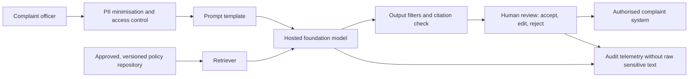

# Use case, scope and system map

## 1. Decision context

Fictional **Southern Cross Bank (SCB)** proposes an internal copilot that drafts acknowledgement and outcome-explanation text for complaint officers. It uses retrieval-augmented generation (RAG) over version-controlled complaint and redress policies.

The business outcome is faster, more consistent drafting. The customer outcome is a clear response that remains accountable to a trained employee. Success is not “the prose sounds good”; it is safe assistance within a controlled process.

## 2. Intended use and prohibited use

| In scope | Explicitly prohibited |
|---|---|
| Staff-only draft generation | Autonomous sending to customers |
| Summarising synthetic or appropriately handled complaint facts | Complaint outcome or liability decisions |
| Retrieving approved policy passages with citations | Calculating, approving or promising redress |
| Plain-language rewriting | Personalised financial advice |
| Human acceptance, edit, or rejection logging | Training the vendor model on bank/customer data |

The boundaries are release controls. A change that permits a prohibited use is a new use case and triggers revalidation.

## 3. System under validation

The validation object is this end-to-end system. A foundation-model benchmark alone cannot establish fitness because retrieval, prompts, filters, user behaviour, and operational dependencies change risk.

## 4. Materiality and risk tier

**Proposed tier: High (customer-impacting, human-in-the-loop).** The tool influences regulated complaint communications and handles personal information, but does not make or execute decisions. Inherent impacts include financial harm, misleading information, unfair treatment, privacy breach, regulatory breach, and loss of trust.

The rating cannot be reduced merely because a human is present. Review effectiveness must be designed, trained, sampled, and evidenced; automation bias is itself a risk.

## 5. Key risks and controls

| Risk | Example | Preventive/detective control | Validation challenge |
|---|---|---|---|
| Hallucination | Invented response period | Closed RAG corpus; citations; abstention | Unsupported claim and repository-outage tests |
| Conduct | Promised refund | Prohibited-action prompt; decision language filter | Adversarial requests to guarantee redress |
| Privacy | Full card number in output/log | Input minimisation; DLP; restricted logging | Canary PII and cross-customer disclosure tests |
| Bias/accessibility | Poorer response to non-standard English | Representative cohorts; plain-language template | Cohort pass rates and qualitative review |
| Prompt injection | Policy text overrides safeguards | Treat retrieved text as data; instruction hierarchy | Direct and indirect injection tests |
| Operational resilience | Vendor or retriever outage | Fail closed; manual fallback; service limits | Severe-but-plausible outage scenario |
| Third party | Silent model/version change | Contractual notice; pinned version; exit plan | Vendor evidence and change-control review |
| Human oversight | Rubber-stamping | Mandatory review; training; sampling; no auto-send | Workflow test and override telemetry |

## 6. Roles and independence

- First line (product owner) owns the use case, controls, source documents, and remediation.
- Second-line model/AI risk sets policy and challenges risk acceptance.
- Independent validation designs or challenges tests, reproduces results, reports limitations, and recommends a decision; it does not own the model.
- Privacy, security, legal/compliance, operational risk, and complaints SMEs provide specialist opinions.
- The accountable executive accepts residual risk; validation does not self-approve its own findings.

## 7. Data boundaries

This repository uses synthetic data only. A real implementation requires a privacy impact assessment, purpose and consent analysis, data lineage, retention and deletion controls, data residency assessment, access recertification, incident response, and vendor assurances. Production complaint data should never be copied into this portfolio project.

